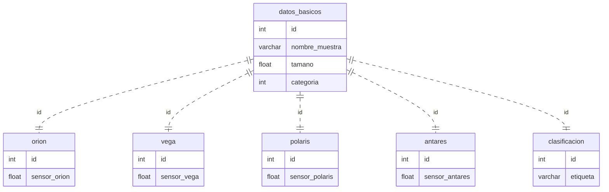

# Solución de Taller Práctico de Clasificación de Datos con Algoritmos de Machine Learning. Asignatura: Automatización y Control

Este es un taller donde se disponen datos en una base sqlite (.db) y se debe entrenar un modelo de machine learning para clasificar unos datos faltantes.

## Objetivos
-Explorar la base de datos [**datos_sensores.db**](./datos_sensores.db) 
- Entrenar un modelo de machine learning que pueda clasificar los datos faltantes de la columna **etiqueta** de la tabla **clasificacion** de la base de datos.
- Almacenar en una carpeta que se llame "output" un csv con el nombre **predicciones.csv** con las clasificaciones hechas con el modelo. 
    
## Descripción 
Se dispone una base de datos perteneciente a un programa secreto en el que se tienen 4 satelites en orbita y son los siguientes:

1. orion
2. vega
3. polaris
4. antares

Estos satelites permiten trabajar con mediciones de diferentes muestras. Cada uno de estos satelites hace una medición numerica (por temas de seguridad se oculta el significado físico de estas mediciones) y se guardan en una base de datos sqlite (.db). datos_sensores.db

Se requiere un modelo de machine learning que pueda clasificar los datos faltantes de la columna **etiqueta**.

# Estructura de la base de datos
_______________________________________________________
Nombre Tabla: **datos_basicos**

Esta tabla contiene los datos basicos de cada muestra

* **id**: identificador unico de la muestra
* **nombre_muestra**: nombre de la muestra
* **tamaño**: tamaño de la muestra en metros
* **categoria**: categoria de la muestra, posibles valores (1,2,3)
________________________________________________________

Nombre Tabla: **orion**

En esta tabla se registraron las mediciones del satelite orion

* **id**: identificador unico de la muestra
* **sensor_orion**: medicion del satelite orion

________________________________________________________

Nombre Tabla: **vega**

En esta tabla se registraron las mediciones del satelite vega

* **id**: identificador unico de la muestra
* **sensor_vega**: medicion del satelite vega

________________________________________________________

Nombre Tabla: **polaris**

En esta tabla se registraron las mediciones del satelite polaris

* **id**: identificador unico de la muestra
* **sensor_polaris**: medicion del satelite polaris

________________________________________________________

Nombre Tabla: **antares**

En esta tabla se registraron las mediciones del satelite antares

* **id**: identificador unico de la muestra
* **sensor_antares**: medicion del satelite antares

________________________________________________________

Nombre Tabla: **clasificacion**

En esta tabla se registraron las clasificaciones de las muestras. Aqui existes 100 datos faltantes que se deben clasificar con un modelo de machine learning.
* **id**: identificador unico de la muestra
* **etiqueta**: etiqueta de clasificacion de la muestra, posibles valores (Positivo, Negativo)

## Diagrama de la base de datos.

### Construcción del modelo
Se implementó un modelo de machine learning tipo random forest en Google Colab. Se hizo uso de código SQL para seleccionar los datos de interés y de acuerdo a las necesidades desde la base de datos. No se tuvo en cuenta la columna de nombre de la muestra ya que no aporta información relevante para el entrenamiento del modelo y simplemente es una enumeración de los datos. Entonces para el modelo solo se usó el dataframe conformado por las columnas, tamaño, categoria, sensor orion, sensor vega, sensor polaris, sensor antares. Se separarón los datos clasificados de los que se requiere predecir su clasificación(etiqueta) mediante verificación de datos nulos usando código SQL y se separó la columna etiqueta; se entrenó y se probó el modelo con el primer grupo de datos(99% para entrenamiento y 1% para testeo) y se obtuvo el nivel de precisión de la predicción usando dos metricas diferentes. Este nivel de precisión se pudo realizar debido que al hacer las predicciones hay unos datos con los cuales comparar dichas predicciones, siendo estos datos de referencia el 1% de los datos del primer grupo mencionado anteriormente. 
Una vez entrenado el modelo y sabiendo que el nivel de precisión dado por las metricas (accuracy , classification_report) era superior a 90% se consideró un modelo optimo, por lo que se realizó las predicciones para el segundo grupo de datos que estaban sin clasificar. Una vez se realizaron las predicciones se asigna los parametros de salida requeridos(postivo, negativo) y se guardan en un archivo csv. Todo este proceso se puede evidenciar, modificar y entender de manera más detallada en el archivo siguiente.(Hacer clic en el enlace)
[**Taller_Clasificacion_ML_AyC.ipynb**](./notebooks/Taller_Clasificacion_ML_AyC.ipynb) 

## Resultados
El modelo final presentó un nivel de precisión de 91%. Debe tenerse en cuenta que usualmente se toman 80-20% de los datos para entrenamiento y test respectivamente, pero en este caso se realizó el modelo con 99-1% ya que fue así como se logró el mayor nivel de precisión. 
Los resultados de las predicciones correspondientes los datos faltantes están en el siguiente archivo.(Hacer clic en el enlace)
[**predicciones.csv**](./output/predicciones.csv) 

## Conclusiones
Es posible construir un modelo que permita predecir los parametros de salida en la columna de etiqueta para los datos faltantes. Se logró clasificar dichos datos usando el modelo random forest. Es importante mencionar que inicialmente se intentó crear un modelo de regresión logística pero el nivel de precisión máximo fue de aproximadamente 50%, por lo que no es optimo, ya que cometería la mitad de errores al hacer las predicciones.
Con el modelo random forest los resultados con el grupo de datos clasificados fue bastante bueno, por lo que es altamente probable que los datos predichos presenten un error muy pequeño en comparación a los reales.

